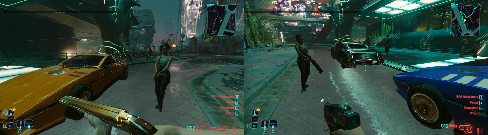

# CP2077 Coop

Building **large multiplayer co-op for Cyberpunk 2077**, with dynamic player groups.
This source tree integrates the typed session foundation from
[Bukczyk/CP2077-Coop](https://github.com/Bukczyk/CP2077-Coop). The downloadable
**v0.0.37 / alpha.5** build remains the earlier two-client prototype for Cyberpunk
**2.31**. Source integration is not a new playable release or a tested player limit.

This is an image screenshot taken from a specific version: **v0.0.37**.

## Download v0.0.37 / alpha.5

### [Download the complete mod ZIP (39 MB)](https://github.com/KyleBuildsAI/cp2077-coop/releases/download/v0.0.37-game-bundle.1/CP2077Coop-v0.0.37-alpha5-game-files.zip)

Includes the co-op scripts, both co-op DLLs, required mod runtimes and matching relay.
Use this ZIP for the existing prototype. GitHub's green **Code > Download ZIP**
contains source, not the complete installation files.

[Release details](https://github.com/KyleBuildsAI/cp2077-coop/releases/tag/v0.0.37-game-bundle.1) |
[Installation guide](game-files/latest/README.md) |
[ZIP checksum](https://github.com/KyleBuildsAI/cp2077-coop/releases/download/v0.0.37-game-bundle.1/CP2077Coop-v0.0.37-alpha5-game-files.zip.sha256)

This is an **experimental prerelease**. Movement needs smoothing, cars are cosmetic
replicas, and shared driver/passenger seats are unfinished. Both players must use
the same package. See [known issues](docs/PLAYTEST_V37_BACKLOG.md).

## Development

[Bukczyk/CP2077-Coop](https://github.com/Bukczyk/CP2077-Coop) is the collaboration
upstream. This repository combines its session foundation with KyleBuildsAI's
retained game features and tests, ready for deliberate feature ports.

- **Active foundation:** `shared/`, `SessionServer/`, `CoopPlugin/`, `runtime/session/`.
- **Preserved prototype:** `bin/`, `r6/`, `plugin/`, `relay/` and the existing game package.
- **Work split:** Bukczyk leads networking/server logic; KyleBuildsAI leads game integration, presentation and live testing.

Start with the [integration record](docs/FOUNDATION_INTEGRATION.md),
[build instructions](docs/DEVELOPMENT.md) and [roadmap](docs/MULTIPLAYER_PLAN.md).
The typed foundation and old package use different protocols. Do not mix their
DLLs or scripts. New features must support player collections rather than one
hard-coded partner; actual supported group sizes need live qualification.

## Requirements for the downloadable prototype

These mod runtimes ship inside the release ZIP:

- [Cyber Engine Tweaks](https://www.nexusmods.com/cyberpunk2077/mods/107)
- [RED4ext](https://www.nexusmods.com/cyberpunk2077/mods/2380)
- [redscript](https://www.nexusmods.com/cyberpunk2077/mods/1511)
- [Codeware](https://www.nexusmods.com/cyberpunk2077/mods/7780) 1.18.0

## Install the downloadable prototype

1. **Download and extract** the complete mod ZIP into a separate folder. Close the game and back up saves and any mod files you will replace.
2. **Copy the contents of `game-root`** (`bin`, `engine`, `r6`, `red4ext`) into your Cyberpunk game folder. Do not copy the enclosing `game-root` folder itself.
3. **Configure the connection.** For a fresh installation, copy `config-examples/transport.ini.example` to `bin/x64/plugins/cyber_engine_tweaks/mods/CP2077Coop/transport.ini` in the game folder. Set the relay address, port, shared room and chosen room key. `127.0.0.1` works only when the relay runs on that computer. Existing installations keep their own configuration.
4. **Run the included relay** using Python 3.12 or newer: `python relay/relay_v2.py --host 0.0.0.0 --port 11778`. Both players must reach that computer over UDP port 11778.
5. **Launch both games** and choose HOST on one and JOINER on the other in the CET **CP2077 Coop** panel. Keep NPC and retained-steering experiments off. See the [full installation guide](game-files/latest/README.md) for configuration and rollback.

## Run

Start the relay, then launch both games and select HOST and JOINER. The
**CP2077 Coop** panel shows connection status, version and ping. Toggle it through
CET **Bindings > Toggle coop panel**. These steps apply to the downloadable prototype.

## Version history

- **Foundation integration:** Added Bukczyk's typed session source for dynamic groups; preserved existing features for porting and kept the tested download unchanged.
- **v0.0.37 / alpha.5 (current download):** Fixed controlled test-NPC movement; complete installation ZIP available.
- **v0.0.36:** Added checks for actual test-NPC spawn placement and improved cleanup.
- **v0.0.35:** Added an optional test NPC and easier-to-reach co-op controls.
- **v0.0.34:** Added experimental native v2 networking with legacy fallback.
- **v0.0.33:** Added a partner marker on the map and minimap.
- **v0.0.32:** Improved joining and state updates; displayed the build version in diagnostics.
- **v0.0.31:** Added legacy combat-hit sharing, ping and expanded diagnostics.
- **v0.0.30:** Added cosmetic replicas of the other player's vehicle.
- **v0.0.29:** Improved remote-player movement with persistent movement commands.
- **v0.0.28:** Fixed repeated join teleports and blocked them while driving.
- **v0.0.27:** Added crouch, weapon, time and weather synchronization.
- **v0.0.26:** Established the initial player-position synchronization baseline.

## Contributors

[KyleBuildsAI](https://github.com/KyleBuildsAI) and [Bukczyk](https://github.com/Bukczyk),
with AI-assisted development, testing and documentation from **Claude Code**,
**ChatGPT**, and **local AI models**.